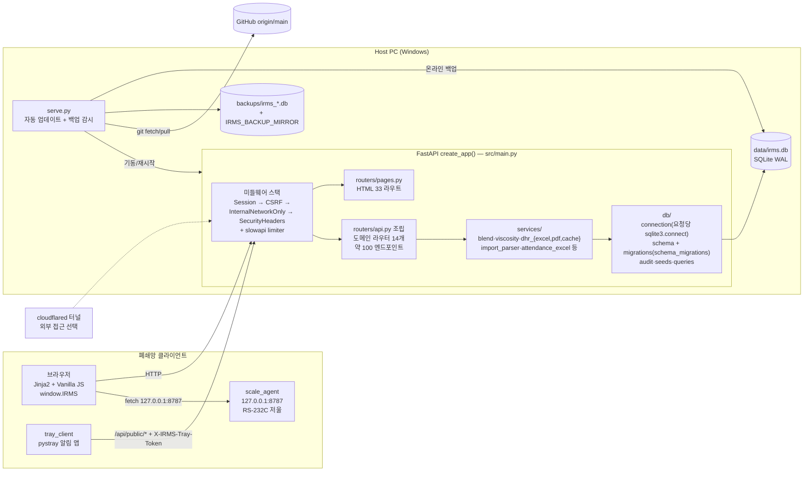
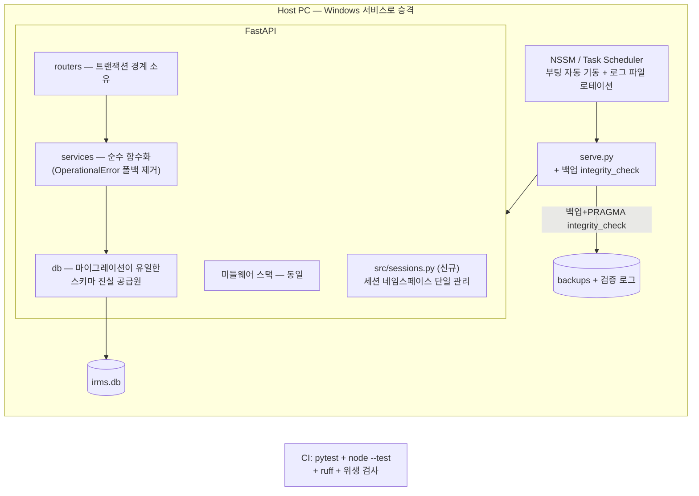

# IRMS(BRM) 설계 문서 — 개선 항목 상세

작성일: 2026-07-12
전제: `01-improvement-plan.md`의 우선순위(P0/P1/P2)를 구현 관점에서 구체화한다.
모든 내용은 실제 코드(`src/main.py`, `src/db/*`, `src/auth.py`, `serve.py` 등) 확인 기반이다.

---

## 1. 현재 아키텍처 (실코드 기준)



인증 평면(현재 4종, 모두 `irms_session` 쿠키 공유):

| 평면 | 세션 키 | 저장소 | 코드 |
|------|---------|--------|------|
| 책임자(이름 기반) | `mgr_worker_id`, `mgr_token` | `workers.session_token` | `src/auth.py` |
| 레거시 users(admin 폴백) | `user_id`, `session_token` | `users.session_token` | `src/auth.py` |
| 배합 작업자 | blend_session 키 | workers | `src/blend_session.py` |
| 근태 | att_user 키 | `attendance_users` | `src/attendance_auth.py` |

특징 요약:
- 모든 라우트가 sync `def`(FastAPI 스레드풀), DB는 요청당 `sqlite3.connect(check_same_thread=False, timeout=30)` + `busy_timeout=5000` + WAL. 8명 규모 적정.
- 스키마 생성은 `db/schema.py`(CREATE IF NOT EXISTS), 변경은 `db/migrations.py`의 순차 마이그레이션 블록.
- 감사로그는 `audit_logs`(action/actor_*/target_*/details_json) 자체 스키마.

---

## 2. 목표 아키텍처

구조 자체는 유지한다(계층 분리·미들웨어·마이그레이션 규율은 이미 목표 형태에 근접).
바꾸는 것은 **경계의 명확화와 운영 안전장치**다.



원칙:
1. **스키마 지식은 `db/`에만**: 서비스가 컬럼/테이블 존재 여부를 감지하지 않는다.
2. **세션 키는 `sessions.py`에만**: 어떤 모듈도 `request.session`의 키 문자열을 직접 쓰지 않는다.
3. **저장소 루트는 소스와 운영 필수물만**: 산출물은 지정 스크래치 경로로, CI가 검증.
4. **백업은 검증돼야 백업**: 생성 즉시 무결성 확인, 실패는 크게 알림.

---

## 3. 주요 개선 항목별 상세 설계

### 3.1 P0-1 레포 위생 — 정리 + 재발 방지

**정리 대상 (실측 기준)**

| 대상 | 조치 |
|------|------|
| 루트 `tmp_*` 디렉터리 43개, `tmpivkqp8nt/`, `__pycache__/` | 삭제 |
| `.venv-wsl-backup-20260527-210916/` (119MB) | 삭제 (WSL 재구성은 bootstrap으로 재현 가능) |
| 루트 PNG/JPG 30여 개 (스크린샷) | 보존 가치 있는 것만 `docs/assets/screenshots/`로 이동, 나머지 삭제 |
| 루트 한글 엑셀 4개(`레시피.xlsx` 등) | `excel/legacy/`로 이동 (import 스크립트 입력 원본이면 경로 인자 갱신) |
| `data/__tmp_*`, `data/audit_ui_test_db/` | 삭제 — **주의: `data/irms.db`는 라이브 DB, 건드리지 않음** |
| `scale_agent/build,dist/`, `tray_client/build,dist/` 내 PyInstaller 산출물 | untracked 산출물 삭제, 빌드 스크립트(`build.bat`, `.spec`)만 유지 |

**재발 방지**

1. 산출물 경로 단일화: `conftest.py`와 E2E/스크립트가 쓰는 임시 경로를 `IRMS_SCRATCH_DIR`(기본 `.tmp-tests/`) 하나로 모은다. 루트에 직접 `tmp_ui19/` 같은 디렉터리를 만드는 스크립트 호출부를 모두 수정.
2. CI 위생 검사(신규 `tools/check_repo_hygiene.py`):
   ```
   실패 조건: 루트 1단계에 (a) glob("tmp_*") 존재, (b) *.png|*.jpg 존재,
              (c) 허용 목록 외 디렉터리 존재
   허용 목록: src, static, templates, tests, tools, scripts, docs, excel,
              cloudflared, scale_agent, tray_client, data, backups, .github 등
   ```
   `.github/workflows/test.yml`에 스텝 1개 추가.

**리스크**: 낮음. 삭제 전 `git status`로 추적 파일이 없음을 확인(이미 확인: 전부 untracked). 운영 PC에도 같은 잔재가 있을 수 있으므로 정리 커밋 배포 후 운영 PC에서 1회 수동 청소 안내.

---

### 3.2 P0-2 백업 무결성 자동 검증

**변경 지점**: `serve.py backup_db()` (현재: 온라인 백업 → 미러 → prune)

```python
def _verify_backup(dest: Path) -> bool:
    """백업 사본 무결성 검증 — 실패한 사본은 이름을 바꿔 보존하고 경고."""
    try:
        conn = sqlite3.connect(f"file:{dest}?mode=ro", uri=True)
        try:
            ok = conn.execute("PRAGMA integrity_check").fetchone()[0] == "ok"
            # 핵심 테이블 최소 행수 확인 (빈 파일 백업 방지)
            n = conn.execute("SELECT COUNT(*) FROM recipes").fetchone()[0]
            return ok and n >= 0
        finally:
            conn.close()
    except Exception:
        return False
```

- `backup_db()` 흐름: 백업 생성 → `_verify_backup()` → 실패 시 `dest.rename(dest.with_suffix('.db.corrupt'))` + `log("⚠ 백업 검증 실패")` → 미러/prune은 검증 통과본만.
- prune 시 `.corrupt` 파일은 별도 보존(원인 분석용, 최근 2개만).
- `docs/ops-backup-restore.md`(신규): 복구 절차(서버 중지 → 사본 복사 → 기동 → `/health` 확인)와 분기별 리허설 체크리스트.

**데이터 흐름 변화**: 없음(읽기 검증만 추가). **리스크**: 검증 자체가 백업 파일을 잠글 수 있으나 `mode=ro` URI로 회피.

---

### 3.3 P0-4 스키마 드리프트 방어 코드 제거

**현상**: `src/services/blend_service.py:74-84`(anchor_material_id), `:99-106`(recipe_steps)가 `sqlite3.OperationalError`를 잡아 "구버전/테스트 DB" 폴백을 수행.

**설계**

1. 테스트 픽스처 경로 확인: `conftest.py`/테스트가 `init_db()`(schema + `apply_schema_migrations`)를 완전 경유하도록 통일. in-memory SQLite 픽스처도 동일 함수로 생성.
2. 운영 DB는 마이그레이션이 보장하므로(anchor·recipe_steps 모두 `db/migrations.py`에 존재) 폴백의 실제 수요는 "마이그레이션을 안 돌린 테스트 DB"뿐 — 1번이 해결되면 수요 소멸.
3. 폴백 제거 순서 (안전한 점진 제거):
   - ① 픽스처 통일 커밋 → 전체 pytest 통과 확인
   - ② 폴백을 `logger.error` + 재raise로 바꿔 1주 운영 관찰 (조용한 폴백이 실제로 발동하는지 확인)
   - ③ 발동 0건 확인 후 try/except 삭제
4. 재발 방지 규칙(CONVENTION 문서): "서비스 레이어에서 `sqlite3.OperationalError`를 잡지 않는다. 스키마 차이는 migrations로만 해소한다."

**인터페이스 변경**: 없음 (함수 시그니처 동일, 예외 정책만 변경).

---

### 3.4 P1-1 세션 네임스페이스 통합 (`src/sessions.py` 신규)

**문제**: 4종 인증이 `irms_session` 쿠키 하나를 공유하며 키 문자열이 3개 파일에 분산. `auth.py:102`의 `_AUTH_SESSION_KEYS` 수동 목록이 유일한 방어선.

**모듈 설계**

```python
# src/sessions.py
from enum import StrEnum
from fastapi import Request

class Scope(StrEnum):
    MANAGER = "mgr"        # 책임자 (auth.py: mgr_worker_id, mgr_token / user_id, session_token)
    BLEND = "blend"        # 배합 작업자 (blend_session.py)
    ATTENDANCE = "att"     # 근태 (attendance_auth.py)

# 스코프별 소유 키의 단일 레지스트리 — 새 키는 반드시 여기 등록
_SCOPE_KEYS: dict[Scope, tuple[str, ...]] = {
    Scope.MANAGER: ("user_id", "session_token", "mgr_worker_id", "mgr_token"),
    Scope.BLEND: (...),       # blend_session.py 에서 이관
    Scope.ATTENDANCE: (...),  # attendance_auth.py 에서 이관
}

def get(request: Request, scope: Scope, key: str): ...
def set_values(request: Request, scope: Scope, **values) -> None: ...
def clear_scope(request: Request, scope: Scope) -> None:
    """해당 스코프 키만 제거 — 다른 평면 세션은 절대 건드리지 않는다."""

def assert_no_key_collision() -> None:
    """스코프 간 키 중복을 import 시점에 검증 (테스트에서도 호출)."""
```

**마이그레이션 전략** (기존 세션 무효화 없이):
1. 1단계: 기존 키 이름 그대로 레지스트리에 등록하고, `auth.py`의 `_clear_auth_session` → `sessions.clear_scope(Scope.MANAGER)`로 위임. `blend_session.py`, `attendance_auth.py` 동일 치환. 쿠키 포맷 불변 → 현장 재로그인 불필요.
2. 2단계(선택): 키에 스코프 접두사(`mgr:*`)를 도입하려면 읽기 시 구키 폴백 → 다음 로그인 때 신키 기록, 2주 후 폴백 제거.
3. 테스트: "책임자 로그인/로그아웃이 blend·att 키를 보존한다" 회귀 테스트를 스코프 조합별로 작성 (기존 사고 시나리오의 고정).

---

### 3.5 P1-2 정적 분석 도입

**`pyproject.toml` 신규** (pytest.ini 흡수):

```toml
[tool.ruff]
target-version = "py311"
line-length = 100
extend-exclude = ["scale_agent/build", "scale_agent/dist", "tray_client/build", "tray_client/dist"]

[tool.ruff.lint]
select = ["E", "F", "I", "B", "UP"]

[tool.mypy]            # 점진 적용: 우선 db/, services/ 만 files 에 포함
files = ["src/db", "src/services"]
check_untyped_defs = true

[tool.pytest.ini_options]
testpaths = ["tests"]
```

- CI 스텝 추가: `ruff check .` → 기존 pytest 앞에 배치.
- 초기 위반은 `ruff check --fix` + `# noqa` 최소화 커밋 1개로 흡수(동작 변경 없는 커밋으로 격리).
- JS: 빌드 도구를 도입하지 않는 현 방침 유지 — `tools/check_frontend_escape.py`(grep 기반)로 `innerHTML` 대입 시 `escapeHtml` 미사용 파일 목록을 CI 경고로 출력, 자체 `escapeHtml` 재정의는 실패 처리.

---

### 3.6 P1-3 대형 모듈 2차 분할

**blend_service.py (878줄) → 패키지화** — `attendance_excel/` 분할(2026-05, `a3b60ab`)과 동일한 검증된 패턴:

```
src/services/blend/
├── __init__.py      # 기존 공개 API 재수출 (from .read import ..., from .write import ...)
│                    #  → 라우터/테스트의 import 경로 변경 없음
├── math.py          # compute_ratios, scale_theory (순수 함수)
├── read.py          # get_recipe_for_blend, _resolve_latest_revision, 목록 조회
└── write.py         # 배합 실적 저장, product_lot 채번, next-lot
```

- 이행: 파일 이동 + `__init__.py` 재수출 → 전체 테스트 통과 → 이후 신규 코드부터 하위 모듈 직접 import.
- `scale_agent/agent.py`(927줄)도 동일: `protocols.py`(A&D/MT-SICS/CAS 프리셋+파서), `server.py`(ThreadingHTTPServer), `config.py`. 단 PyInstaller `.spec`의 entry가 `agent.py`이므로 `agent.py`는 얇은 진입점으로 남긴다(빌드 스크립트 무변경).
- `static/js/blend.js`(802줄): 이미 `blend_lib.js` 분리가 있으므로(커밋 `41fdf64`), 렌더링/이벤트를 `blend_render.js`로 추가 분리하고 템플릿에서 `<script>` 순서로 로드(모듈 번들러 불도입 유지).

---

### 3.7 P1-4 Windows 서비스화

- 방식: NSSM(권장) 또는 Task Scheduler "시스템 시작 시" + 재시작 정책.
- `serve.py`는 그대로 서비스 본체가 된다(자동 업데이트·백업 로직 보존). 변경점:
  - stdout이 콘솔이 아닐 수 있으므로 로그를 `logs/serve_%Y%m%d.log`로 파일 출력 + 14일 로테이션(현재 `log()` 함수 한 곳만 수정하면 됨, `serve.py:63`).
  - `free_port()`의 PowerShell 의존은 서비스 계정에서도 동작 확인 필요.
- `setup_server.bat`을 서비스 등록 스크립트로 확장(NSSM 다운로드/등록/시작).
- 리스크: 서비스 계정 권한으로 `git pull`(자격 증명)과 `%APPDATA%` 접근이 달라질 수 있음 → 현장 PC에서 로그인 계정 기반 Task Scheduler를 1차 채택하고 NSSM은 검증 후.

---

### 3.8 P2-1 관측성 (구조화 로깅)

- `src/middleware/request_log.py`(신규): 요청 ID(uuid4 hex 8자) 생성 → `request.state.request_id` → 응답 헤더 `X-Request-ID` + 로그 1줄(JSON: ts, rid, method, path, status, dur_ms, actor).
- actor는 `sessions.py` 경유로 스코프별 식별자(책임자 이름/작업자 이름/사번)를 마스킹 수준 결정 후 기록.
- 느린 쿼리: `db/connection.py`의 `get_connection()`에 `sqlite3.Connection.set_trace_callback` 기반 옵션(환경변수 `IRMS_SLOW_QUERY_MS`, 기본 off)을 추가 — 운영 진단 시에만 켠다.

---

### 3.9 신규 기능: 자재 LOT 역추적 (중기 로드맵 1순위)

**근거 데이터**: `blend_details.material_lot`(`db/migrations.py:230`), `blend_records.product_lot`. 스키마 변경 불필요.

**API** (신규 `src/routers/lot_trace_routes.py`, 책임자 권한):

```
GET /api/lot-trace?material_lot=<LOT>&from=<date>&to=<date>&limit=100
→ {
    "material_lot": "...",
    "usages": [
      { "blend_record_id": 1, "product_lot": "제품명26071201",
        "product_name": "...", "material_name": "...",
        "actual_amount": 123.4, "worked_at": "...", "worker": "..." }
    ]
  }
```

- 쿼리: `blend_details JOIN blend_records` 단일 SELECT, `material_lot` 인덱스 추가 마이그레이션 1건(`CREATE INDEX IF NOT EXISTS idx_blend_details_material_lot ...`).
- 화면: `templates/status.html`(배합 기록 화면)에 검색 탭 추가 또는 dashboard에 카드 추가 — 신규 페이지보다 기존 화면 확장이 현장 학습 비용이 낮다.
- 부분 일치(`LIKE prefix%`) 지원: 현장 LOT 표기 흔들림 대응. 파라미터 바인딩 유지.

---

## 4. 마이그레이션 전략과 리스크

### 4.1 단계별 적용 순서 (운영 무중단 우선)

| 단계 | 내용 | 배포 영향 |
|------|------|-----------|
| 1 | 위생 정리(3.1) + 문서 현행화 | 코드 무변경 — 안전 |
| 2 | 백업 검증(3.2) + CI 게이트(ruff/위생 검사) | serve.py만 변경, 서버 코드 무변경 |
| 3 | 테스트 픽스처 통일 → 폴백 관찰 모드 → 제거(3.3) | 관찰 기간 1주 포함 |
| 4 | sessions.py 1단계(키 이름 불변 위임) (3.4) | 세션 포맷 불변 — 재로그인 불필요 |
| 5 | blend_service 패키지화(3.6) — 재수출로 import 불변 | 순수 리팩터링 |
| 6 | 서비스화(3.7), scale_agent 분할, 관측성(3.8) | 현장 PC 절차 변경 수반 — 별도 공지 |
| 7 | LOT 역추적 등 신규 기능 | 인덱스 마이그레이션 1건 |

각 단계는 독립 커밋/배포 가능하며, `serve.py`의 자동 업데이트 특성상 **한 커밋 = 한 운영 반영**이므로 단계 간 혼합 커밋을 금지한다.

### 4.2 리스크 목록과 완화

| 리스크 | 영향 | 완화 |
|--------|------|------|
| 자동 업데이트(git pull) 경로로 리팩터링이 즉시 운영 반영됨 | 회귀가 곧바로 현장 장애 | 리팩터링 커밋 전 `python -m pytest tests` + `tools/smoke_irms.py --mode production` 필수. 대규모 변경은 `IRMS_AUTO_UPDATE=0`으로 감시 끈 뒤 수동 반영 |
| 픽스처 통일 시 마이그레이션 전체 실행으로 테스트 느려짐 | CI 시간 증가 | in-memory DB + 세션 스코프 픽스처 1회 생성 후 트랜잭션 롤백 재사용 |
| 세션 리팩터링 실수로 현장 전원 로그아웃 | 배합 입력 중단 | 1단계는 키 이름 불변(3.4). 스코프 보존 회귀 테스트 선작성 |
| OperationalError 폴백 제거 후 미지의 구버전 DB 존재 | 특정 PC 500 오류 | 관찰 모드(로그+재raise) 1주 → 발동 0건 확인 후 삭제 |
| 서비스화 후 git 자격 증명/권한 차이 | 자동 업데이트 정지 | 로그인 계정 Task Scheduler 우선, `has_update()` 실패는 이미 무해하게 로깅됨(`serve.py:96`) |
| 루트 정리 중 라이브 데이터 오삭제 | 비가역 손실 | `data/irms.db*`, `backups/` 제외 목록 명시, 정리 직전 수동 백업 1회, MEMORY의 "대시보드=라이브 데이터" 주의 준수 |
| ruff 일괄 수정 커밋에 동작 변경 혼입 | 조용한 회귀 | `--fix` 커밋은 단독으로 격리, diff에서 auto-fix 외 변경 금지 |

### 4.3 명시적으로 하지 않는 것

- **Postgres 이행**: 동시 8명·단일 쓰기 노드에서 SQLite WAL은 적정. P2-4의 트리거(동시성 지연 체감, DB 크기, 다중 라인 확장) 충족 전 착수하지 않는다.
- **프론트 빌드 도구(번들러) 도입**: `?v=` 캐시버스팅 + `<script>` 분할 로드로 충분. 현장 PC 배포 단순성이 우선.
- **async 전환**: sync 라우트 + 스레드풀 구조는 현 부하에서 병목이 아니며, sqlite3 드라이버 특성상 전환 이득이 없다.
